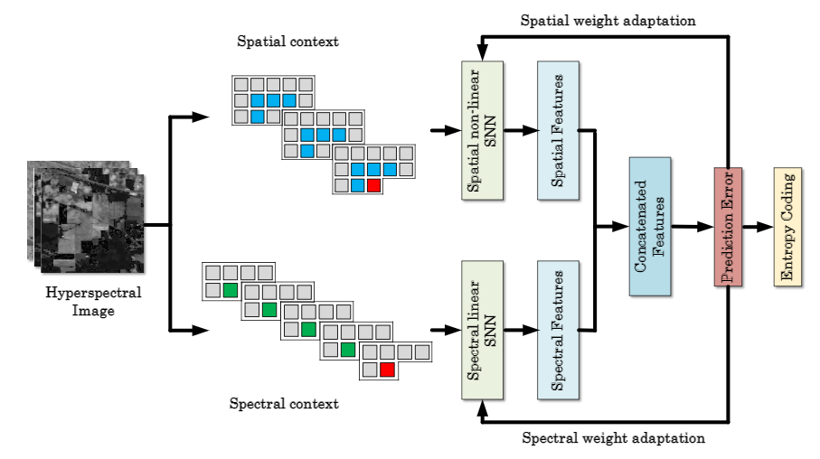

[](https://www.tensorflow.org/)
[](https://www.python.org/downloads/)
[](https://colab.research.google.com/github/DM1122/fpcnn)
[](https://github.com/psf/black)
[](https://pre-commit.com/)
[](https://github.com/DM1122/fpcnn)
[](https://github.com/DM1122/fpcnn)

[](https://github.com/DM1122/fpcnn/actions/workflows/pytest.yml)
[](https://codecov.io/gh/DM1122/fpcnn)


# FPCNN
FINCH Predictive Coder Neural Network.

A full end-to-end implementation of the [CSNN](https://www.mdpi.com/2313-433X/6/6/38) state-of-the-art compression algorithm for hyperspectral image data. Developed by the [University of Toronto Aerospace Team](https://www.utat.ca/space-systems) :milky_way:.

<p align="center"></p>

# Usage
Check out the interactive Google Colab [notebooks](https://colab.research.google.com/github/DM1122/fpcnn) to start tinkering.

# Contribution
## Setup
This section will take you through the procedure to configure your development environment. At a glance:
1. Install project's python version
1. Install git
1. Install poetry
1. Clone repository
1. Run poetry install
1. Configure IDE virtual environment
1. Install pre-commit hooks

Begin by installing the project's python version. See the badges at the top of the README for the version number.

If not already installed, install [git](https://git-scm.com/).

The repo employs [poetry](https://python-poetry.org/)  as its dependency and environment manager. Poetry can be installed through the Windows Powershell via:
```
(Invoke-WebRequest -Uri https://raw.githubusercontent.com/python-poetry/poetry/master/install-poetry.py -UseBasicParsing).Content | python -
```

Clone the repo using [Github Desktop](https://desktop.github.com/)  or the commandline via:

```
git clone https://github.com/DM1122/fpcnn.git
```

From within the cloned repo, run poetry's install command to install all the dependencies in one go:
```
poetry install
```

Configure your IDE to use the virtual environment poetry has created at `C:\Users\<USERNAME>\AppData\Local\pypoetry\Cache\virtualenvs`. In the case of [VSCode](https://code.visualstudio.com/) , enter the command pallet by going to `View>Command Palette` and search for `Python:Select Interpreter`. Select the appropriate poetry virtual environment for the repo. Restart VSCode if you do not see it listed.

Install the pre-commit script and hooks using:
```
pre-commit install --install-hooks
```

You're now ready to start contributing!

## Adding Packages
To add a new package to the poetry virtual environment, install it via:
```
poetry add <package>
```
This is poetry's version of `pip install <package>`.

## Testing
This repo uses [pytest](https://docs.pytest.org/en/6.2.x/) for unit testing. To run all unit tests, call:

```
pytest -v
```

You can find an interactive report of test results in `./logs/pytest/pytest-report.html`. Individual tests can also be specified as follows:
```
pytest tests/test_<filename>.py::<function name>
```

Groups of tests can be run using markers. Assign a marker decorator to the group of functions you want to test like this:

```
@pytest.mark.foo
def my_test_function():
    # some test
```

To use the custom marker `foo`, it must be added to the list of custom pytest markers in `pyproject.toml>[tool.pytest.ini_options]>markers`. The tests marked with `foo` can then be run by calling:
```
pytest -v -m foo
```

Or to avoid all tests with a particular marker, call:
```
pytest -v -m "not foo"
```


## Commits
### Pre-Commit
This repo is configured to use [pre-commit](https://pre-commit.com/) hooks. The pre-commit pipeline is as follows:

1. [Isort](https://pycqa.github.io/isort/): Sorts imports, so you don't have to.
1. [Black](https://black.readthedocs.io/en/stable/): The uncompromising code autoformatter.
1. [Pylint](https://github.com/pycqa/pylint): It's not just a linter that annoys you!

Pre-commit will run the hooks on commit, but when a hook fails, they can be run manually to delint using:

```
isort . & black . & pylint_runner
```

# Workflow Structure
To improve the organization of this repository and reduce conflicts, branches will be organized as follow:
1. `main` - the branch containing the most recent working release. All code in this branch should run perfectly without any errors.
2. `dev` - branched off of `main`; the most updated version of the project with the newest features and bug fixes.
3. `features/<feature-name>` - branched off of `dev`; a feature branch. **Features must be tested thoroughly before being merged into **`dev`

For more information check out: https://gist.github.com/digitaljhelms/4287848

## Creating issues:
You can create a new task as follows:
1. Navigate to the "Projects" tab
2. Create a new task in the "To Do" column
3. Click on the three dots in the top right corner of the card and select "Convert to issue"
4. \[Optional\] Assign yourself or somebody else to the issue
5. \[Optional\] Add the issue to a milestone (useful for breaking a large task into smaller tickets)

## Taking on Tickets:
1. Select your issue (either on Projects board or through the "Issues" tab)
2. Change the status of the issue to "In Progress" (either slide the card to the "In Progress" column in the Projects board, or change the status on the issue's page)
3. Create a new branch of the form `features/<feature-name>`, do some ✨ m a g i c ✨, and create a Pull Request
4. Request a teammate for code review, and link your PR to its respective issue
5. If all goes well, merge it in :D


